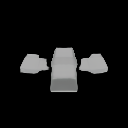

# 3D Model Generator (Text & Image to 3D)

This project leverages OpenAI’s Shap-E, a powerful conditional generative model, to create 3D models from various inputs, including text descriptions and 2D images. Shap-E is a significant advancement in 3D content creation, offering efficient and high-quality generation of complex 3D assets.

## ✅ Features
- **Text-to-3D Generation:** Transform textual prompts into detailed 3D models. Describe an object, and Shap-E will generate its 3D representation.
- **Image-to-3D Generation:** Convert 2D images into corresponding 3D models. This allows for the reconstruction of 3D objects from existing visual data.
- **Dual Output Representation:** Unlike many other 3D generative models, Shap-E can directly generate parameters for implicit functions, which can then be rendered as both **textured meshes** and **neural radiance fields (NeRFs)**. This provides flexibility for different applications and rendering needs.
- **Fast Generation:** Shap-E is designed for efficiency, capable of generating complex and diverse 3D assets in a matter of seconds.
- **High-Quality Output:** The model produces high-fidelity 3D models, making it suitable for professional applications in various industries.

## ⚙️ How Shap-E Works
Shap-E employs a two-stage training process:
1.  **Encoder Training:** An encoder is trained to map existing 3D assets into the parameters of an implicit function. This function essentially defines the 3D shape and its properties.
2.  **Conditional Diffusion Model Training:** A conditional diffusion model is then trained on the outputs of this encoder. This diffusion model learns to generate these implicit function parameters conditioned on text or image inputs.

When given a text prompt or an image, the diffusion model generates the appropriate implicit function parameters, which can then be decoded into a 3D representation.

## 🚀 Applications of Shap-E
Shap-E's capabilities open up new possibilities across various industries:
-   **Game Development:** Rapid prototyping and generation of game assets (characters, props, environments).
-   **Product Design:** Quickly visualize and iterate on product concepts in 3D.
-   **Architecture:** Generate 3D models of buildings and structures from descriptions or sketches.
-   **Augmented and Virtual Reality (AR/VR):** Create immersive 3D content for AR/VR experiences.
-   **Creative Arts:** Empower artists to generate complex 3D forms from abstract ideas.
-   **Education:** Develop interactive 3D models for learning and visualization.

## 📁 Project Structure
-   `notebooks/`: Contains Google Colab notebooks for easy execution and experimentation.
-   `outputs/`: Stores the generated 3D model files (e.g., `.gif`, `.ply`, `.obj`).

### Sample Output (Text_to_3D && Image_to_3D)
# Text-to-3D: Prompt given: "A chair in banana shape"
- 
# Text-to-3D: Prompt given: "A car looks like aeroplane"
- 
# Image-to-3D: Image used: apple.jpeg
- 
